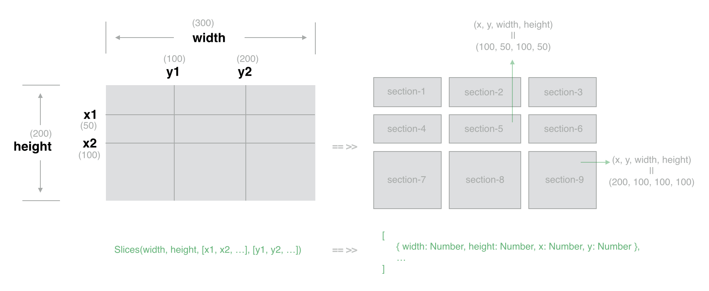

<p style="text-align: center">
    
</p>

# slices

> Slice given area into blocks by the given reference lines

[![NPM version][npm-image]][npm-url] [![Downloads][downloads-image]][npm-url]

[](https://npmjs.org/package/slices)

[npm-url]: https://npmjs.org/package/slices
[downloads-image]: http://img.shields.io/npm/dm/slices.svg
[npm-image]: http://img.shields.io/npm/v/slices.svg

```js
var Slices = require('slices');
var blocks = Slices(500, 500, [100], [100]);
```

Get blocks:

```js
[
    { width: 100, height: 100, x: 0, y: 0 },
    { width: 400, height: 100, x: 100, y: 0 },
    { width: 100, height: 400, x: 0, y: 100 },
    { width: 400, height: 400, x: 100, y: 100 }
]
```

# Installation

```
npm install slices
```

# API

### Slices(width, height, lineXArray, lineYArray)

- **width:** Number of pixels wide
- **height:** Number of pixels high
- **lineXArray:** Reference lines of the x axis
- **lineYArray:** Reference lines of the y axis

### Slices(width, height, lineXArray, lineYArray, options])

Slice with some optional parameters.

Available options:

- **middleBoundaryMode:** true or false, default is false


# Testing

```
npm test
```

# License

MIT, see the [LICENSE](/LICENSE) file for detail.

