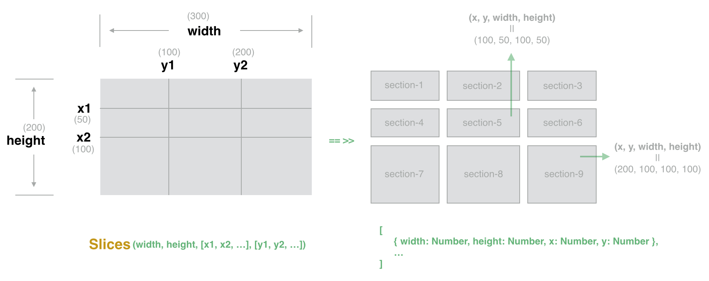
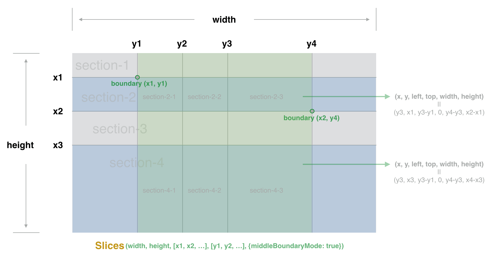

<p style="text-align: center">
    
</p>

# slices

> Slice given area into blocks by the given reference lines

[![NPM version][npm-image]][npm-url] [![Downloads][downloads-image]][npm-url]

[](https://npmjs.org/package/slices)

[npm-url]: https://npmjs.org/package/slices
[downloads-image]: http://img.shields.io/npm/dm/slices.svg
[npm-image]: http://img.shields.io/npm/v/slices.svg

```js
var Slices = require('slices');
var blocks = Slices(500, 500, [100], [100]);
```

Get blocks:

```js
[
    { width: 100, height: 100, x: 0, y: 0 },
    { width: 400, height: 100, x: 100, y: 0 },
    { width: 100, height: 400, x: 0, y: 100 },
    { width: 400, height: 400, x: 100, y: 100 }
]
```

# Installation

```
npm install slices
```

# API

### Slices(width, height, lineXArray, lineYArray [, options])

- **width:** Number of pixels wide
- **height:** Number of pixels high
- **lineXArray:** Reference lines of the X axis
- **lineYArray:** Reference lines of the Y axis
- **options:** Slice with some optional parameters, see [options](#options) for detail.

## Options

### middleBoundaryMode

True or false, default is false.

This will put space between the X axises as parent-block,
the areas between the first Y axis and last Y axis will be children of the parent-block, and it will generate boundary data.

```js
Slices(width, height, [x1, x2], [y1, y2, y3], {middleBoundaryMode: true});
```

Get blocks like below:

```js
[
    {
        "width": 500,
        "height": 100,
        "x": 0,
        "y": 0,
        "children": [
            {
                "width": 100,
                "height": 100,
                "x": 100,
                "y": 0,
                "left": 0,
                "top": 0,
                "parentBlockIndex": 0,
                "index": 0
            },
            {
                "width": 100,
                "height": 100,
                "x": 200,
                "y": 0,
                "left": 100,
                "top": 0,
                "parentBlockIndex": 0,
                "index": 1
            }
        ],
        "boundary": {
            "leftTop": {
                "x": 100,
                "y": 0
            },
            "rightBottom": {
                "x": 300,
                "y": 100
            }
        }
    },
    ...
]
```

<p style="text-align: center">
    
</p>

# Testing

```
npm test
```

# License

MIT, see the [LICENSE](/LICENSE) file for detail.

